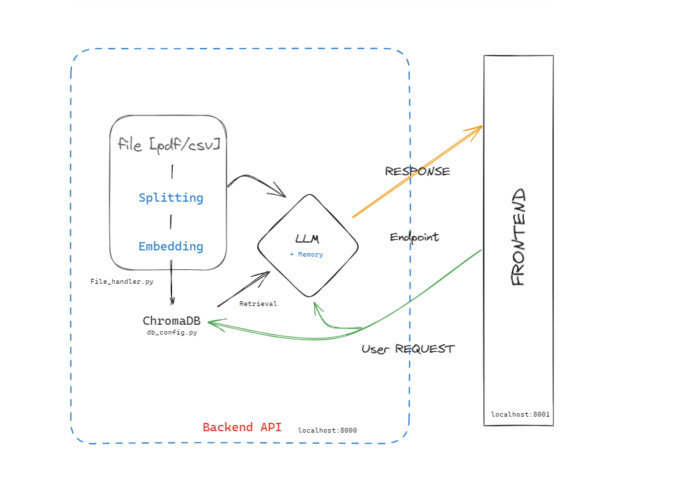

# Document-Understanding AI Assistant

## Overview
This application leverages advanced AI to understand and answer questions based on PDF or CSV files. It utilizes LangChain, ChromaDB, and OpenAI's models.

## Features
- Custom file handling command for PDF/CSV files.
- Django Rest API Backend with a frontend application.
- Integration with LangChain and OpenAI's models.
- ChromaDB for embedding data storage and retrieval.
- LangChain for conversational and user feedback mechanism

## Running the Application
0. `pip install -r requirements.txt`
1. `cd duha`

### Backend :: [Django-Rest Framework - API Engine]
2. Run `python manage.py runserver 8000` to start the Django server on port 8000.

### Frontend (Port 8001)
3. Open a new terminal and start a separate (frontend) server on `python manage.py runserver 8001`
3. Alternatively, you may navigate to the "templates/index.html" and run a live server from VS Code.

### File Handling
4. Drop your PDF or CSV file in the `library` folder and run the command `python manage.py file_handler .\library\<filename>`
4. Alternatively, run the command `python manage.py file_handler <path to your preferred PDF / CSV>`
- The file_handler custom command handles the splitting, embedding and saving of the file chunks to a persistent ChromaDB.

## API Interaction
The application is secured with authentication and uses Django's REST framework.

## Contributing
Contributions are welcome in the form of comments. 
